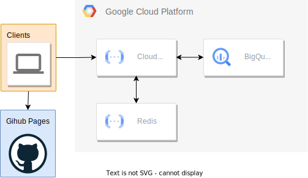

# Immersio

_BlankDeadSnail_'s submission

## Inspiration

Immersio is an eCommerce platform focused on providing the most immersive shopping experience possible to the user.
The first branch of this project is a movie store realized in a 3D environment that allows one to select and buy movies from over 45,000 entries.

We cannot wait to show you what we have in store for the future!

## What it does

The user is presented with a compelling 3D-rendered environment where a small selection of the available movies is presented to them as posters.
The user can then select a movie, verify the details, and buy it.
While the selections are random and can be refreshed an infinite number of times, the user can also search for a specific movie by title or some keywords.

## How we built it

The project is made of different components.
The front end is a React application that uses the Three.js library to render the 3D visuals on a canvas, allowing great flexibility in the camera movement and the rendering.  
The backend is a [Google Cloud Function](https://cloud.google.com/functions?hl=en) written in Python.
When the frontend needs to retrieve the list of movies, it calls the backend, which in turn queries the [Google Cloud BigQuery](https://cloud.google.com/bigquery?hl=en) database.
It has been pre-populated with the data from the [Kaggle dataset](https://www.kaggle.com/rounakbanik/the-movies-dataset), containing over 45000 movies.
A quick script featuring the [pandas](https://pandas.pydata.org/) library cleaned up the data before the upload.
Since querying the database is a costly operation, if the operation is successful, the backend will cache the result in a [redis](https://redis.io/) database, so that the next time the same query is performed, the result will be retrieved from the cache instead of the database.

## Challenges we ran into

Getting every single part of the project to work was challenging.

The backend proved to be very slow, so we had to implement a caching system to speed up the process.
Since we also wanted to have both random and search functionality, we had to implement a way to query both types of requests, including a way to seed the randomness.
The latter was achieved by using the MD5 hashing function.

The front end was probably the most challenging part of the project.
Just understanding the inner workings of the Three.js library took a lot of time, and we had to learn a lot about 3D rendering and the different types of cameras and their settings.

## Accomplishments that we're proud of

Although we ran into many struggles in the development of this project, we believe that the final product is polished and easy to use and test.
We are hosting it on a GitHub page, so anyone can try it out without having to install anything.

## What we learned

We learned a lot about 3D rendering and the Three.js library.
We also learned how to use the Google Cloud Platform, how to use and query BigQuery in less obvious ways, and how easy it is to deploy Cloud Functions services after testing them locally.
Finally, it was the first time we used redis, and we learned how to exploit it to speed up the backend significantly.

# What's next for Immersio

The project could easily be expanded in the future.
More movies could be added, together with an integrated streaming service.
It would be possible to widen the scope of the project to include other types of products, like videogames, books, or even general merchandise.
The 3D environment could be expanded to include more elements, like a shopping cart or a checkout counter.
Finally, it would be possible to add AI-powered shopping assistants to help the user on their virtual trip to the store.
